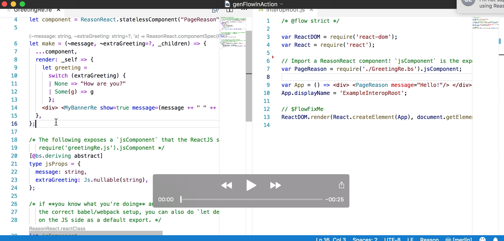
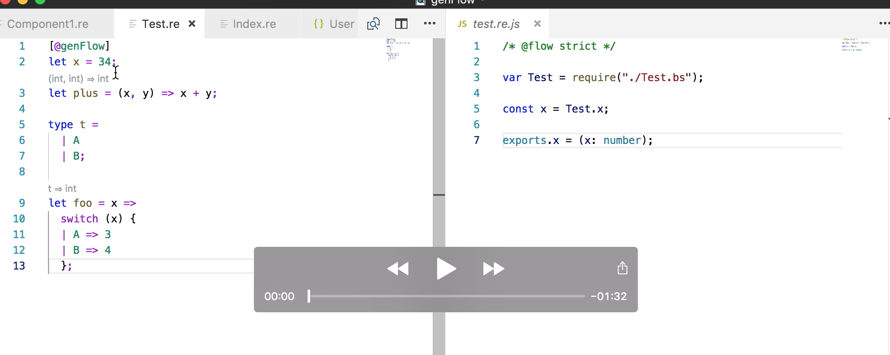

# Reason genFlow

`genFlow` is a tool to automatically generate type-safe bindings between [Reason](https://reasonml.github.io/) and [Flow](https://flow.org/en/). It also generates typed wrappers for [ReasonReact](https://reasonml.github.io/reason-react/) components.

[This is how to convert an existing component](https://youtu.be/k9QYjq0c8rA)
[](https://youtu.be/k9QYjq0c8rA)

[This is the code generated behind the scene](https://youtu.be/0YLXGBiB9dY)
[](https://youtu.be/0YLXGBiB9dY)


# New Project Setup

1. Set environment variable `BS_CMT_POST_PROCESS_CMD` as explained below before building or starting a watcher.
2. Add a file `shims.txt`, and a directory `shims/` just like in the sample project.
3. Add some `[@genFlow]` annotations to the values to be used from JS. If an annotated value uses a type, the type must be anotated too.

# Limitations
Currently `genFlow` only supports bucklescript projects with in-source generation of `.bs.js` files. For `File.re`, bucklescript generates `File.bs.js` alongside it. If some values in `File.re` are annotated with `[@genFlow]` then `genFlow` also generates `File.re.js`, which can be imported by flow-typed javascript files.

Currently `genFlow` does not support `[@genFlow]` annotations in interface files (`.rei`). Also, it does not support nested modules: annotations inside modules are ignored.

# Development

## Build genFlow

```
# You will need esy to install all dev dependencies
npm install -g esy

esy install

# This will build the GenFlow.exe binary
esy build
```

## Build the sample js project

```
# in sample-project
export BS_CMT_POST_PROCESS_CMD="$PWD/../_build/default/src/GenFlow.exe --setProjectRoot $PWD"
yarn install
yarn build
```

Every time genFlow changes, clean and build again:

```
yarn clean
yarn build
```

## Hot reloading plus genFlow

```
# in sample-project
export BS_CMT_POST_PROCESS_CMD="$PWD/../_build/default/src/GenFlow.exe --setProjectRoot $PWD"
yarn start
yarn serve
```

## Type check with Flow
```
# in sample-project
flow
```
